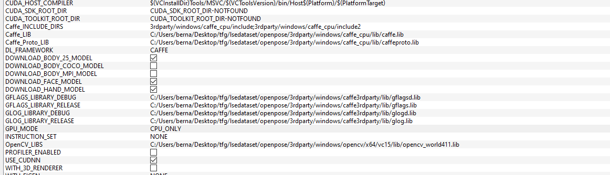

# lsedataset
Spanish Sign Language dataset 

## Getting Started

This project will consist of the construction of a video data set, subtitles of sign language people and their corresponding poses.
The [Openpose](https://github.com/CMU-Perceptual-Computing-Lab/openpose/) - The principal framework to detect the poses.

### Prerequisites

To run this project, you need to install some version greater than Python 3 (with pip) and Git.

#### Ubuntu
##### Python

```
Open a Terminal
sudo apt update
sudo apt-get install python3.X 

  X is the number of version
```

##### Pip

```
Open a Terminal
sudo apt update
sudo apt-get install python3-pip
```

##### Git

```
Open a Terminal
sudo apt update
sudo apt-get install git
```

#### Windows

##### Python

```
1. Open a browser window and navigate to the Download page for Windows at python.org.
2. Underneath the heading at the top that says Python Releases for Windows, click on the link for the Latest Python 3 Release - Python 3.x.x. 
3. Scroll to the bottom and select either Windows x86-64 executable installer for 64-bit or Windows x86 executable installer for 32-bit. (See below.)
4. Run the installer
```
##### Pip

```
1. Before installing PIP, you’ll need to download get-pip.py: get-pip.py on pypa.io.
2. Open a cmd and navigate to download directory.
3. Run the command:
        python get-pip.py
4. Check the version:
        pip --version
```

##### Git

```
1. To install Git on Windows you will need to download the installer from the Git website:
2. Download the most current version for your operating system by double clicking on the package name:
3. Select Run to begin the installation:
4. Click Yes to continue:
5. Click Next to continue:
```

### Installing

#### Clone or Download the project

```
1. Click to clone or download in the button that it is situated at top of this page.
2. Copy the link if you want clone it and go to 3. or download and unzip the file wherever you want.
3. Go to the directoy you want and execute:
      git clone **link** 
  Where the link is the result of second step
```

#### Install the Requeriments
```
1. Go to the directory 'lsedataset' 
2. Run the command:
      pip install -r Requirements.txt
```

#### Clone or download Openpose

```
1. Go to the directory 'lsedataset' 
  (if you want to go by commmand execute 'cd lsedataset' after clone this project)
2. Go to https://github.com/CMU-Perceptual-Computing-Lab/openpose/ and click to clone or download in the button situated at top of that page.
3. Copy the link if you want clone it and go to 3. or download and unzip the file in the new directory.
4. Execute 
      git clone **link** 
  Where the link is the result of second step
```
#### Install Openpose GPU only mode

##### Install Cmake

```
  Windows
1. Install CMake GUI: Download and install the Latest Release of CMake Windows win64-x64 Installer from the CMake download website, called cmake-X.X.X-win64-x64.msi
2. Install Microsoft Visual Studio (VS) 2017 Enterprise with all C++-related flags when selecting the components to install.

  Ubuntu
1. Run the command:
      sudo apt-get install cmake-qt-gui.
```

##### OpenPose Configuration

1. Open CMake GUI and select the OpenPose directory as project source directory, and a non-existing or empty sub-directory called `build` where the Makefile files (Ubuntu) or Visual Studio solution (Windows) will be generated. If `build` does not exist, it will ask you whether to create it. Press `Yes`.
<p align="center">
    
    
</p>

2. Press the `Configure` button, keep the generator in `Unix Makefile` (Ubuntu) or set it to your 64-bit Visual Studio version (Windows), and press `Finish`. Select the option `only CPU` in `GPU model`
<p align="center">
    
    
</p>
<p align="center">
    
    
</p>

3. If this step is successful, the `Configuring done` text will appear in the bottom box in the last line. Otherwise, some red text will appear in that same bottom box.
<p align="center">
    
    
</p>

4. Press the `Generate` button and proceed to [OpenPose Building](#openpose-building). You can now close CMake.


For more information go to Openpose installation document:
* [Openpose](https://github.com/CMU-Perceptual-Computing-Lab/openpose/blob/master/doc/installation.md) 

##### Build Openpose

###### Ubuntu

Build the project by running the following commands.

cd build/
make -j`nproc`

###### Windows

Open the Visual Studio solution (Windows), called build/OpenPose.sln. Then, set the configuration from Debug to Release and press the green triangle icon to run it.

## Deployment

Tu run this project you have to go to the lsedataset directory, enter in sample folder and execute this:

```
  python lsedataset.py ej.txt
where the ej.txt is a filetext that it contains url for playlist or videos.
```

## Authors

* **Rubén Bernabé Menéndez** 


## License

This project is licensed under the MIT License - see the [LICENSE.md](LICENSE.md) file for details


